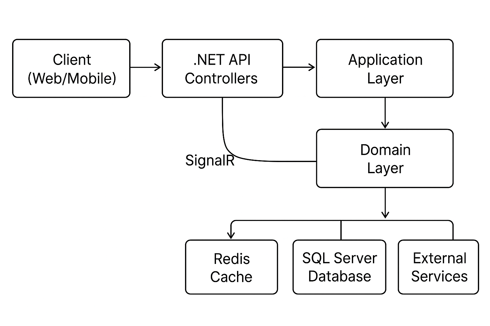

## Tour Operator Data Import Engine

A high-performance .NET Web API for processing large pricing and seat allocation files from tour operators. This system provides secure file upload, real-time progress reporting, and efficient data processing with Redis caching.

## 🏗️ Architecture

### System Architecture Diagram

### Clean Architecture Layers

- **API Layer**: Controllers, authentication, and SignalR hubs
- **Application Layer**: Use cases, commands, queries, and validation
- **Core Layer**: Entities, enums, and business rules
- **Infrastructure Layer**: Data access, repositories, and external services

## 🚀 Features

### ✅ Implemented Requirements

1. **Authentication & Roles**
    - JWT-based authentication with role-based access control
    - Roles: Admin (full access) and TourOperator (restricted to own data)
    - Secure token generation with claims for TourOperatorId

2. **Secure File Upload Endpoint**
    - POST `/api/pricing-upload` for CSV file processing
    - Role-based authorization (TourOperator only)
    - Automatic association with authenticated user's TourOperatorId
    - CSV validation and sanitization

3. **Caching Strategy**
    - GET `/api/data/{tourOperatorId}` with pagination
    - Redis caching for 5 minutes to reduce database load
    - Admin role restriction for data access

4. **Progress Reporting with SignalR**
    - Real-time progress updates during file processing
    - Connection-based messaging for specific clients
    - Batch processing updates with percentage completion

5. **Error Handling and Logging**
    - Structured logging with Serilog
    - Comprehensive exception handling across layers
    - Validation using FluentValidation

## 🛠️ Technology Stack

- **Framework**: .NET 8
- **Database**: SQL Server with Entity Framework Core
- **Caching**: Redis with StackExchange.Redis
- **Real-time Communication**: SignalR
- **Authentication**: JWT Bearer Tokens
- **Architecture**: Clean Architecture with MediatR pattern
- **Validation**: FluentValidation
- **Logging**: Serilog with console and file sinks
- **Containerization**: Docker with Docker Compose

## 📋 API Endpoints

### Authentication
- `POST /api/auth/login` - User login
- `POST /api/auth/register` - User registration
- `POST /api/auth/logout` - User logout

### Pricing Data
- `POST /api/pricing-upload` - Upload CSV pricing file (TourOperator role)
- `GET /api/data/{tourOperatorId}?page=1&pageSize=100` - Get paginated data (Admin role)

### Real-time Communication
- SignalR Hub: `/progressHub` - For progress updates during file processing

## 🗄️ Database Schema

### Users Table
- `Id`, `Username`, `Email`, `PasswordHash`, `Role`, `TourOperatorId`

### PricingRecords Table
- `Id`, `TourOperatorId`, `RouteCode`, `SeasonCode`, `Date`
- `EconomyPrice`, `BusinessPrice`, `EconomySeats`, `BusinessSeats`, `CreatedAt`

## 🔧 Installation & Setup

### Prerequisites
- Docker and Docker Compose

# Start all services
docker-compose up -d

## Connect to SignalR
### Using Postman's WebSocket
-  ws://localhost:5232/progressHub
### Send this message to initialize hub connection
- {"protocol":"json","version":1}

### Get connectionId from response and upload to the api

